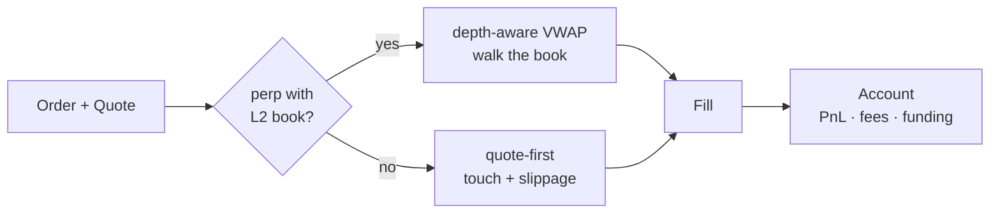

<div align="center">

# PaperPit

**A fill simulator for paper trading.**
Give it quotes and orders — get realistic fills, with fees, slippage, and funding, for spot and perpetuals.

[](https://github.com/Pratiikpy/PaperPit/actions/workflows/ci.yml)
[](./LICENSE)


</div>

---

Most backtests and "paper trading" modes fill you at the last price for free. That flatters every
strategy and hides the trades that would never have filled. PaperPit removes that lie: it fills at
the touch, models size-aware slippage, walks the order book when you have depth, charges taker fees,
and settles funding on perp positions — and it runs the same way in backtest and live paper mode, so
results don't change shape when you switch.

It's a small TypeScript library with **zero runtime dependencies**, plus an optional **MCP server**
so an AI agent can trade through it.

## How fills work

PaperPit picks the fill model that matches the data you actually have:



- **Quote-first** — fills at the touch (ask to buy, bid to sell) plus size-aware slippage. For when
  you only have top-of-book, or an instrument whose L2 book is thin or published intermittently and
  the always-present bid/ask is the honest signal.
- **Depth-aware** — walks the L2 book for a true VWAP and returns a partial fill when the book runs
  out. For when you have real depth and want price impact modelled, not approximated.

## Install

```bash
git clone https://github.com/Pratiikpy/PaperPit.git
cd PaperPit
npm install
npm test
```

Node 18+. TypeScript runs directly via `tsx` — no build step.

## Quickstart

```ts
import { PaperPit } from "paperpit";
import type { MarketQuote } from "paperpit";

const sim = new PaperPit();
sim.createAccount("demo", 10_000);

const quote: MarketQuote = { symbol: "AAPL", bid: 199.9, ask: 200.0, last: 199.95 };

const fill = sim.submit(
  { id: "1", accountId: "demo", symbol: "AAPL", kind: "spot", side: "buy", type: "market", qty: 10, ts: Date.now() },
  quote,
);

console.log(fill.status, fill.avgPrice, fill.feePaid); // → filled 200.04 2.0004
```

```bash
npm run example   # open, buy, mark up, sell, print PnL
npm run replay    # replay recorded frames, with a resting limit order + funding
```

## Replay recorded data

PaperPit is source-agnostic. Record quotes from any venue as newline-delimited JSON frames:

```json
{ "ts": 1718000000000, "quotes": { "BTCUSDT": { "symbol": "BTCUSDT", "bid": 61000, "ask": 61010, "last": 61005, "fundingRate": 0.0001 } } }
```

```ts
import { PaperPit, loadFrames, quotesOf } from "paperpit";

const sim = new PaperPit();
sim.createAccount("demo", 10_000);

for (const frame of loadFrames("frames.jsonl")) {
  const quotes = quotesOf(frame);
  sim.onMarket(quotes);     // settle resting limit orders
  sim.applyFunding(quotes); // charge / receive funding on open perps
}
```

## Use it from an AI agent (MCP)

`src/mcp.ts` is a Model Context Protocol server (stdio) so an agent can paper-trade through the
sandbox. It speaks MCP's JSON-RPC directly, so it adds no dependencies.

```jsonc
// MCP client config (Claude Desktop, Cursor, Codex, …)
{
  "mcpServers": {
    "paperpit": { "command": "npx", "args": ["tsx", "src/mcp.ts"] }
  }
}
```

| Tool | Does |
|---|---|
| `create_account` | Open an account with a starting balance. |
| `quote` | Set the current bid/ask/last (and funding) for a symbol. |
| `submit` | Place an order against the stored quote; returns the fill. |
| `account` | Cash, positions, realized/unrealized PnL, fees, funding, equity. |
| `fills` | Every fill this session. |

## API

| Export | What it is |
|---|---|
| `PaperPit` | The engine — `createAccount`, `submit`, `onMarket`, `applyFunding`, `marksFrom`. |
| `Account` | Cash, spot/perp positions, realized & unrealized PnL, fees, funding, `equity()`. |
| `quoteFill` · `depthFill` | The two pure fill models, usable standalone. |
| `loadFrames` · `parseFrames` · `quotesOf` | Replay helpers for recorded JSONL frames. |
| `DEFAULT_FILL` · `DEFAULT_FEES` | Tunable slippage and fee defaults. |

Configure per engine: `new PaperPit({ fees, fillCfg })`.

## What it doesn't do

The boundary matters more than a feature list:

- It's **not** a strategy engine or backtest loop — you drive it with your own orders and data.
- It models **taker** fills (crossing the spread). Passive maker fills, queue position, and
  partial-fill-then-cancel dynamics are out of scope.
- Slippage is a configurable model, not a reconstruction of true market impact.
- It's single-process and in-memory — persistence and concurrency are yours.

## License

MIT — see [LICENSE](./LICENSE).
